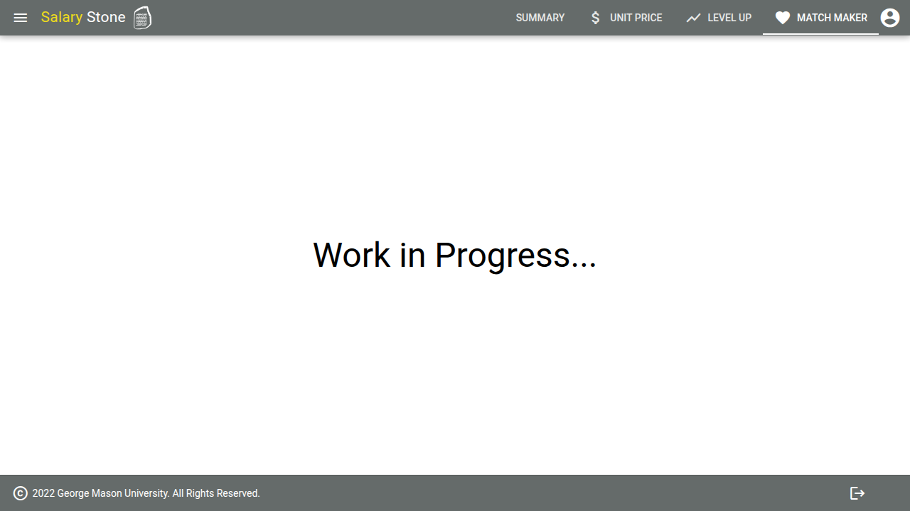

# Salary Stone UI

A salary analysis and prediction tool built with [Quasar](https://quasar.dev/) (Vue 3). It connects to a backend API to predict expected salaries, extract skills from job descriptions and resumes, and recommend skills for salary growth.

## Screenshots

### Login


### Summary


### Unit Price


### Level Up


### Match Maker


## Install the dependencies
```bash
yarn
# or
npm install
```

### Start the app in development mode (hot-code reloading, error reporting, etc.)
```bash
quasar dev
```


### Lint the files
```bash
yarn lint
# or
npm run lint
```


### Format the files
```bash
yarn format
# or
npm run format
```


### Build the app for production
```bash
quasar build
```

### Customize the configuration
See [Configuring quasar.config.js](https://v2.quasar.dev/quasar-cli-vite/quasar-config-js).
